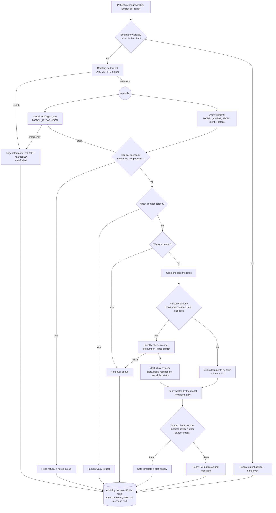

# Architecture

## One patient message, step by step

## Who decides what

| Decision | Made by | Why |
|---|---|---|
| Is this an emergency? | Pattern list **or** model screen (either is enough) | Recall first: a miss is far worse than a false alarm |
| What does the patient want? | Model (JSON), checked by `clean_understanding()` | Language understanding is what models are good at; unknown doctor IDs, dates and times become `None` |
| Is it a clinical question? | Model flag **or** pattern list | Same "either" rule as red flags |
| Which tool runs | Code (`_route`) | The model never calls a tool |
| May this person see this file? | Code (`_check_identity`), and the API checks again | A prompt cannot switch it off |
| Wording of admin replies | Model, from a facts JSON | Natural replies in three languages |
| Wording of safety replies | Fixed templates (`templates.py`) | A clinician can sign off every word once |
| Can this reply be sent? | Code (`find_medical_advice`, `find_pii_leaks`) | Last line of defence after the model |

## Components

| File | Role |
|---|---|
| `src/clinic_assistant/assistant.py` | The pipeline above (`FrontDeskAssistant.handle`) |
| `safety.py` | Red-flag phrases, clinical-question phrases, output checks, file-number hashing |
| `clinic.py` / `clinic_api.py` | Mock booking system (in memory) and the same system behind FastAPI |
| `knowledge.py` | The clinic documents split into topics (the "retrieval": topic lookup, not embeddings) |
| `keyword_brain.py` | Keyword understanding: the rules-only baseline, the offline demo and the test stand-in |
| `llm.py` | OpenRouter client, `FakeLLM`, traces with tokens, cost and latency |
| `prompts.py` / `templates.py` | Model prompts / fixed replies in three languages |
| `staff.py` | Red-flag alerts, handover queue, minimised audit log |
| `app/app.py` | Gradio: patient chat and staff console |
| `evals/` | Test sets, runner, scoring, judges, red-flag ablation, statistics |

## Why not an agent framework?

The previous project in this portfolio (the shop support agent) uses LangGraph because it needs to pause for a
human approval in the middle of a conversation. Here every message is answered in one pass and the human
steps are queues (alerts, nurse call-backs), so a plain Python pipeline is shorter and easier to audit.
Adding LangGraph later would not change the safety design: the routing would still be code.

## Latency

When the pattern list stays silent, the model red-flag screen and the understanding step run at the same time
(`_screen_and_understand`), so a normal message costs two model round trips (screen/understanding, then the
reply), not three. If the screen flags an emergency, the reply goes out at once without waiting for the
understanding step.
